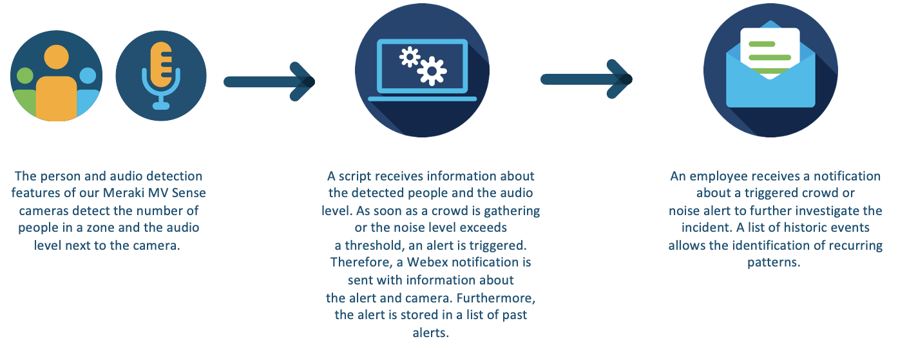
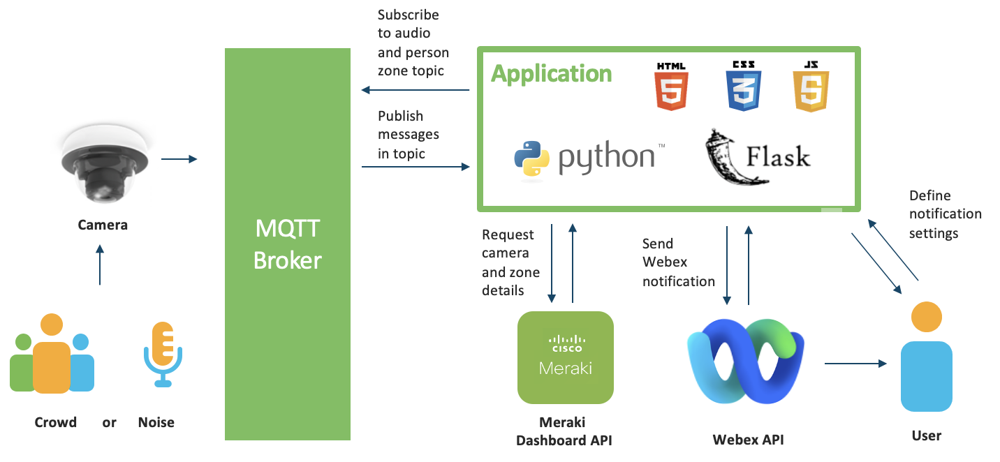
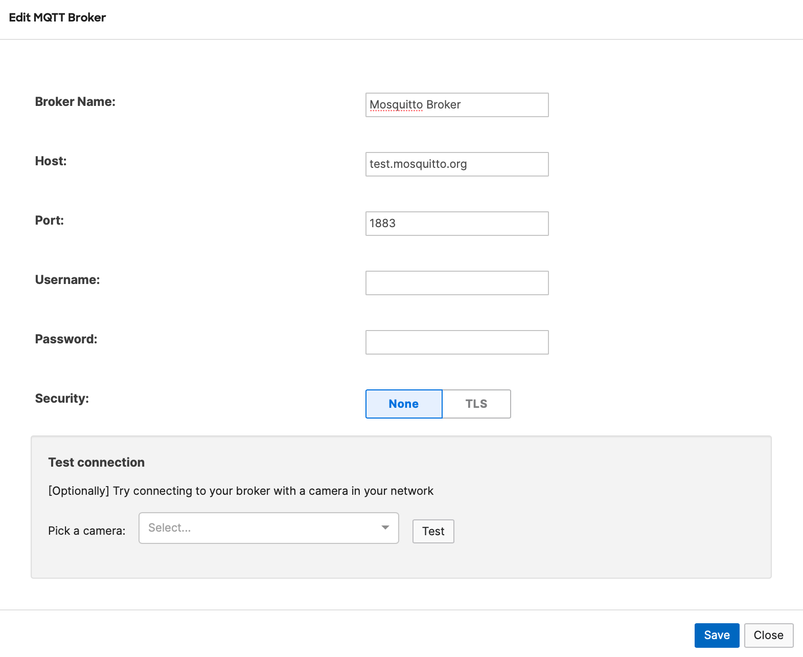

# Meraki Noise and Crowd Notifier

The purpose of this sample code is to notify about an occurring crowd gathering or noise pollution based on the person and audio detection feature of Meraki MV cameras. 
In case of a crowd (within a specific zone) or noise alert, a Webex message is sent to a Webex user. Further information about the noise level, person count, camera, and a snapshot of the detected event provides additional insights. Furthermore, all past events are stored and listed on a dedicated page. A settings page allows defining the trigger values, like noise level, person count, time span of occurrence, and Webex recipient.  
The script supports multiple cameras within the same network.

> Note: This demo is an enhanced and highly adapted version of the former GVE DevNet use case: https://github.com/gve-sw/MerakiMVCrowdNotifier


## Contacts
* Ramona Renner
* Gerardo Chaves


## Solution Components
* Meraki MV Camera
* Webex App
* Local or online MQTT Broker


## Workflow




## Architecture




## Webex App

This demo sends alert notifications to a Webex user. Please install the [Webex App and create a Webex account](https://www.webex.com/downloads.html) if you do not have one yet.


## MQTT Broker

MQTT is a client-server publish/subscribe messaging transport protocol. This sample code requires the setup of a locally installed or online MQTT broker that gathers the data from all cameras and publishes it to our sample script. Popular MQTT brokers are, for example: Mosquitto or HiveMQ.

Online brokers are easier to set up and use, but they can involve delays in data delivery. For simplicity, example values for the use of an online broker are mentioned in the next sections. [A list of public brokers](https://github.com/mqtt/mqtt.org/wiki/public_brokers).

In case the use of a local broker is preferred, the [Meraki Mosquitto - MQTT Broker Guide](https://developer.cisco.com/meraki/mv-sense/#!mqtt/mosquitto--mqtt-broker) describes the configuration of a local broker.


## Meraki MQTT Setup

In the Meraki Dashboard:

1. Start by navigating to **Cameras** > **Monitor** > **Cameras** and clicking the camera you would like to enable MV Sense on.
2. Once the camera is clicked, go to **Settings** > **Sense**.
3. Enable the **Sense API** and **Audio Detection**.
4. To enable MQTT on your camera and create a new MQTT broker configuration, click **Add or edit MQTT Brokers**.
5. Enter the following information for your broker:

* **Broker Name** – Name for the broker. e.g. Mosquitto Broker
* **Host** – Broker IP address or hostname. e.g. test.mosquitto.org
* **Port** – TCP port number for MQTT. e.g. 1883
* **Security** – Enable or disable TLS.
> Note: For demo purposes, use None as value for the field Security. Please be aware that it is recommended to use TLS in production setups. Further adaptions of this code are required for the latter.   

Optionally, test the connection between the camera and the broker to ensure communication.
Furter information about this, is available in the official [Meraki MV MQTT Guide](https://developer.cisco.com/meraki/mv-sense/#!mqtt/configuring-mqtt-in-the-dashboard).




# Camera Zones

Meraki allows you to narrow the camera and detection view via zones. This sample code only detects people within a camera zone. Thereby, follow the [Instructions for MV Zones](https://developer.cisco.com/meraki/mv-sense/#!zones) to set up one or more zones. 


## Installation

1. Make sure Python 3 and Git are installed in your environment, and if not, you may download Python 3 [here](https://www.python.org/downloads/) and Git as described [here](https://git-scm.com/book/en/v2/Getting-Started-Installing-Git).
2. Create and activate a virtual environment for the project ([Instructions](https://docs.python.org/3/tutorial/venv.html)).
3. Access the created virtual environment folder
    ```
    cd [add name of virtual environment here] 
    ```
4. Clone this Github repository:  
  ```git clone [add github link here]```
  * For Github link: 
      In Github, click on the **clone or download** button in the upper part of the page > click the **copy icon**  
      
  * Or simply download the repository as a zip file using 'Download ZIP' button and extract it
4. Access the downloaded folder:  
    ```cd gve_devnet_meraki_noise_and_crowd_detection```

5. Install all dependencies:  
  ```pip3 install -r requirements.txt```


6. Configure the environment variables in the **config.py** file:  
      
    ```
    MERAKI_API_KEY = "<API key for Meraki account>"
    NETWORK_ID = "<ID of the Meraki network for which cameras will be considered for monitoring. Only cameras with defined zones will be included.>"

    BOT_ACCESS_TOKEN = "<Webex Bot access token>"

    MQTT_SERVER = "<MQTT broker ip or domain (e.g. "test.mosquitto.org")>"

    MQTT_PORT = <MQTT broker port being utilized (e.g. 1883)>

    COLLECT_CAMERAS_MVSENSE_CAPABLE=<Array of valid camera models with MVSense API. e.g. ["MV12", "MV22", "MV72"]>

    MOTION_ALERT_ITERATE_COUNT = <Minimum number of mqtt messages counted to indicate that an activity has successfully occurred. e.g. 10>
    MOTION_ALERT_PAUSE_TIME = <Pause time after an alert is triggered e.g. 5>
    TIMEOUT = <Number of messages until action times out due to in activity e.g. 20>
    ``` 
> Note: Follow the instructions [here](https://developer.cisco.com/meraki/api/#!authorization/obtaining-your-meraki-api-key) to obtain the Meraki API Token.

> Note: Retrieve the network ID via the interactive API documentation and the [Get Organizations Call](https://developer.cisco.com/meraki/api-v1/#!get-organizations) and [Get Organization Networks Call](https://developer.cisco.com/meraki/api-v1/get-organization-networks/).

> Note: Follow the instructions [here](https://developer.webex.com/docs/bots) to create a Webex bot and to obtain the Webex Bot access token. 


## Starting the Application

Run the script by using the command:
```
python3 flask_app.py
```

## Usage

Assuming you kept the default parameters for starting the Flask application, the address to navigate would be: http://localhost:5001


1. Fill in all settings form fields:
* **Webex Recipient** - email address of the Webex user that will receive the notifications.
* **People Count** - person count threshold. A value above the person count is classified as a crowd. 
* **Crowd Dwell Time** - minimum time of crowd occurrence. The time a crowd (based on People Count) has to occur at least for to trigger an alert.
* **Noise Level** - negative decibel value threshold (smaller = louder). A threshold smaller than this negative decibel value is classified as noise event. 
* **Noise Dwell Time** - minimum time of noise occurrence. The time a noise (based on Noise Level) has to occur at least to trigger an alert.

An alert will be triggered if the person count or the noise level exceeds the threshold for the specific dwell time.

2. Click the **Set Detection Values** button to save the values.    
3. Click the **Start Detecting** button to start detecting and logging alerts. The button changes to **Stop Detecting**, so you can click on it again to stop the detection. 
4. At any point that there are alerts already recorded, you can click on the **Alert History** header menu button to navigate to a page that lists all past alerts. 


### LICENSE

Provided under Cisco Sample Code License, for details see [LICENSE](LICENSE.md)

### CODE_OF_CONDUCT

Our code of conduct is available [here](CODE_OF_CONDUCT.md)

### CONTRIBUTING

See our contributing guidelines [here](CONTRIBUTING.md)

#### DISCLAIMER:
<b>Please note:</b> This script is meant for demo purposes only. All tools/ scripts in this repo are released for use "AS IS" without any warranties of any kind, including, but not limited to their installation, use, or performance. Any use of these scripts and tools is at your own risk. There is no guarantee that they have been through thorough testing in a comparable environment and we are not responsible for any damage or data loss incurred with their use.
You are responsible for reviewing and testing any scripts you run thoroughly before use in any non-testing environment.